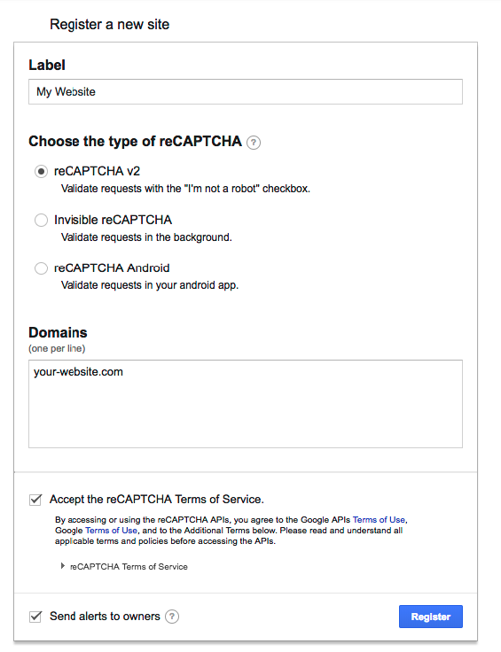

# reCAPTCHA Setup

This will guide you through getting Google reCAPTCHA working with Formly. If you already have a reCAPTCHA field in your form you can skip to step 2.

1. Register a new site at https://www.google.com/recaptcha/admin. Choose 'reCAPTCHA v2' as your type. Specify the domains that are valid for hosting the reCAPTCHA i.e. your website domain.



Once registered, you will receive two keys. The site key which will be used in your form and the secret key which you will add to your project on Formly.

2. Add the reCAPTCHA widget to your form. There is an example of how to do this on the site. For static websites that do not use a library that controls the rendering of markup such as React, the best way is to paste this snippet before the closing `</head>` tag on your site:

```
<script src='https://www.google.com/recaptcha/api.js'></script>
```

Paste this snippet inside of your `<form>` tags where you want the reCAPTCHA widget to appear:

```
<div class="g-recaptcha" data-sitekey="your-site-key"></div>
```
Replace the `data-sitekey` attribute value with your site key.

For libraries like React you will need to make use of a module that loads the reCAPTCHA script asynchronously. We recommend [react-google-recaptcha](https://github.com/dozoisch/react-google-recaptcha).
