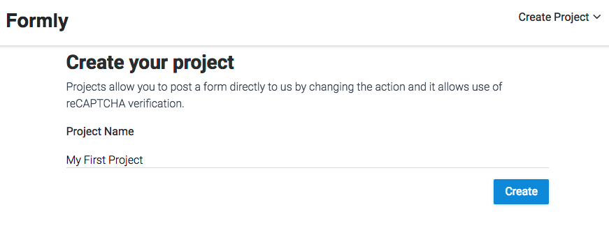
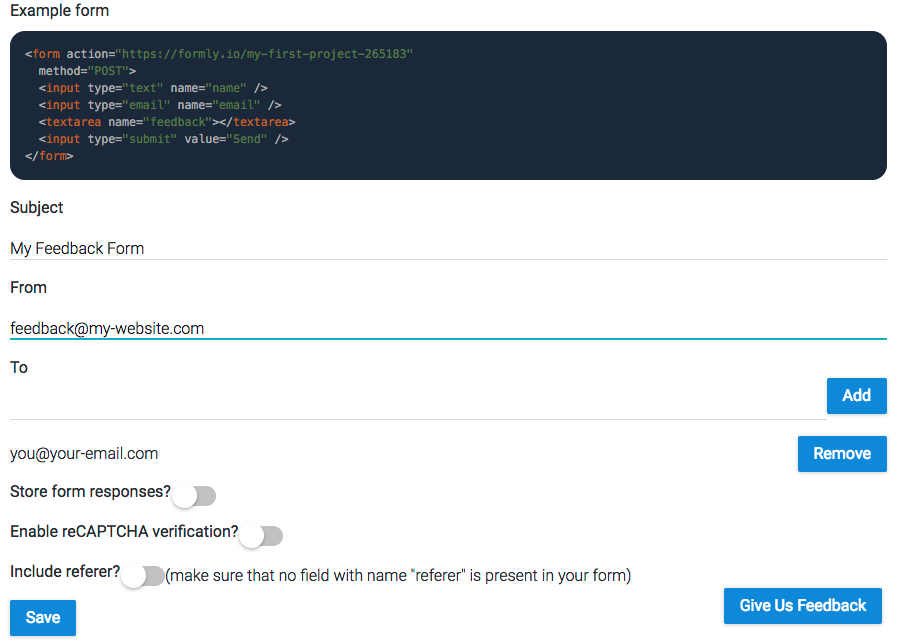
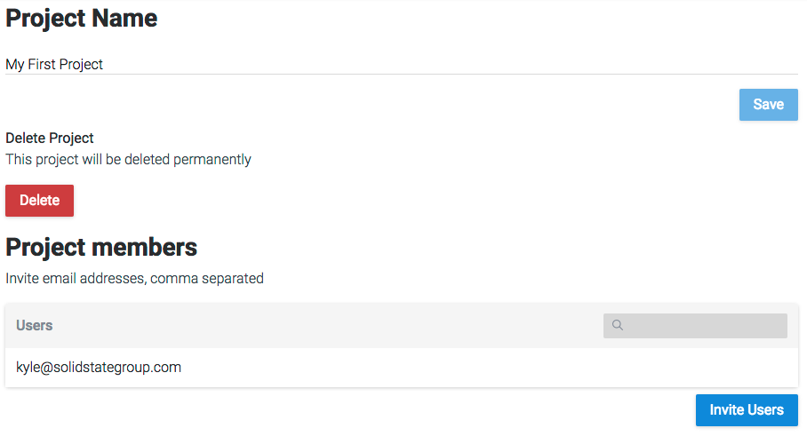

# Creating a project

Go to the Formly [site](https://formlyapp.com), click Login, Don't have an account? and then fill up the form to register. You will be presented with the create project page. Type in a name and create your first project.

This will take you directly into the form settings page. Here you can configure how we will send your form data, reCAPTCHA verification and more. At the top is an example of a typical feedback form that has the action pointing to us.

# Form settings

Fill in the Subject, From and To fields. All three fields are required for successful form submission however the from field can be sent as part of your form data instead.

Click Save. Submit your form data to us using the project ID found in the example form action and you will get an email containing your form data.

You will have noticed there were more options available to you below the To field.

**Store form responses?** - Enabling this will store responses to your form with us. This means you do not necessarily need to go through your email to look back on a forms response history.

**Enable reCAPTCHA verification?** - Enabling this will allow you to use Google's reCAPTCHA field for securing your form against spam. All you need to provide us with is your secret key.

**Include referer?** - Enabling this will add a field named "referer" to your form data that shows the page URL that they submitted the form from.

# Project settings

Here you can change the name of your project (but never it's ID), delete it or invite other users by email address.

